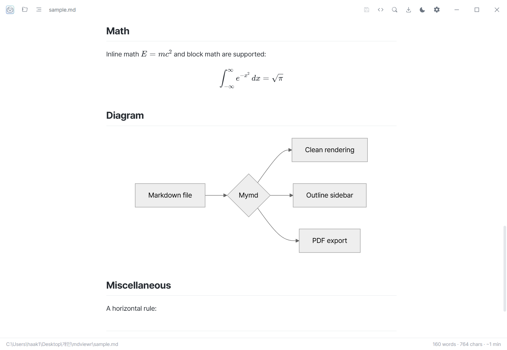
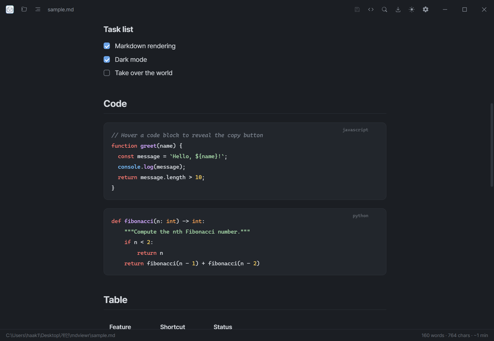

<p align="center">
  
</p>

<h1 align="center">Mymd</h1>

<p align="center">
  <a href="https://github.com/yssyss2323/md-viewer/releases/latest"></a>
  
  
</p>

<div align="center">
  <strong>A clean, distraction-free markdown viewer.</strong><br>
  Focused on whitespace and typography.<br>
  <sub>Available for Windows and macOS.</sub>
</div>

<br>

| Light | Dark |
| --- | --- |
|  |  |
|  |  |

## Download

Grab the latest installer from the [**Releases**](https://github.com/yssyss2323/md-viewer/releases/latest) page — no setup or dependencies needed:

- **Windows** — download `Mymd Setup <version>.exe` and run it.
- **macOS (Apple Silicon, M1+)** — download `Mymd-<version>-arm64.dmg`, open it, and drag **Mymd** into Applications.
- **macOS (Intel)** — same, using `Mymd-<version>.dmg`.

> **macOS note:** the app is not signed with an Apple Developer certificate, so
> on first launch macOS shows *"Mymd can't be opened because Apple cannot
> check it for malicious software."* Right-click the app in Applications →
> **Open** → **Open**, and macOS will remember the choice. (Or run
> `xattr -dr com.apple.quarantine "/Applications/Mymd.app"`.)

## Features

- **Clean, distraction-free reading** in light or dark themes
- **Source view & editing** — flip to the raw markdown, edit, and save (`Ctrl+E` / `Ctrl+S`)
- **One window per file** — open documents side by side, grouped under a single taskbar/dock icon
- **Full markdown** — KaTeX math, Mermaid diagrams, syntax-highlighted code, tables, task lists, and GitHub-style callouts
- **Any reading font** — bundled fonts or anything installed on your computer, with adjustable size and width
- **Find, outline sidebar, PDF export**, and live auto-reload when the file changes
- **Korean / English** interface

## Keyboard Shortcuts

| Action | Keys |
| --- | --- |
| Open file | `Ctrl+O` |
| Save | `Ctrl+S` |
| Find | `Ctrl+F` (close with `Esc`) |
| Toggle outline | `Ctrl+B` |
| Toggle source view / edit | `Ctrl+E` |
| Toggle theme | `Ctrl+Shift+L` |
| Export to PDF | `Ctrl+P` |
| Zoom in / out / reset | `Ctrl+=` / `Ctrl+-` / `Ctrl+0` (or `Ctrl` + wheel) |

## Development

<details>
<summary>Build from source, package installers, and customize the icon (for contributors — not needed to just use the app).</summary>

### Run from source

```
npm install   # first time only
npm start     # or: npm start -- path\to\file.md
```

### Build installers

```
npm run dist       # Windows installer (.exe)  — run on Windows
npm run dist:mac   # macOS disk image (.dmg)    — run on macOS
```

The Windows build produces an NSIS installer at `dist\Mymd Setup <version>.exe`; installing associates `.md` / `.markdown` files with Mymd.

### Automated releases (CI/CD)

`.github/workflows/build.yml` builds both platforms on GitHub's runners. Pushing a version tag creates a Release with the installers attached:

```
npm version minor        # bumps package.json and creates a git tag
git push --follow-tags   # triggers the workflow
```

macOS can only be built on a macOS machine, so this workflow is how the `.dmg` is produced — no Mac required locally.

### App icon

`build/icon.png` (app icon) and `build/icon.ico` (multi-resolution, used for the Windows `.md` file-type icon) are generated from `logo.png` by `build/make-icon.ps1` — it trims to the artwork, centers it, makes the corners transparent, and emits a 1024px PNG plus a 16–256px `.ico`. Regenerate with:

```
powershell -ExecutionPolicy Bypass -File build\make-icon.ps1
```

### Project structure

- `main.js` — Electron main process (windows, file open/watch, settings, PDF)
- `preload.js` — markdown rendering pipeline + IPC bridge
- `renderer/` — UI (HTML/CSS/JS)

</details>

## License

MIT
