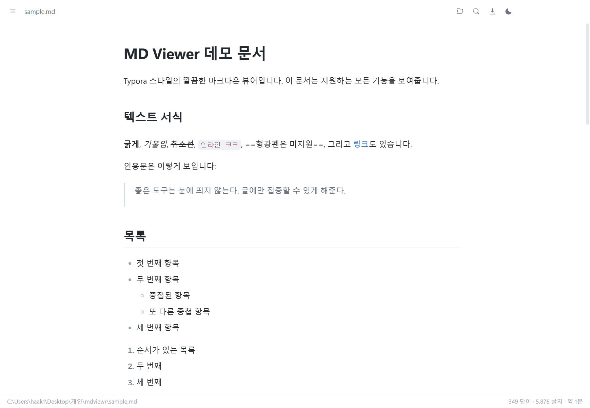
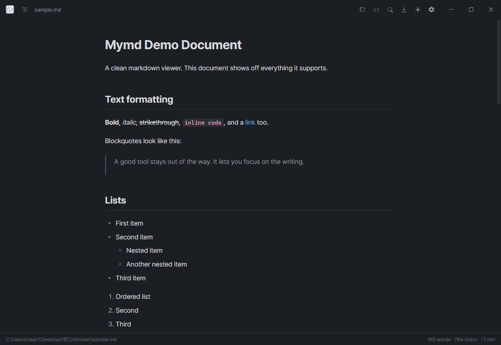

# MD Viewer

A clean, distraction-free markdown viewer for Windows, built with Electron. Focused on whitespace and typography.

| Light | Dark |
| --- | --- |
|  |  |

## Getting Started

```
npm install   # first time only
npm start     # or: npm start -- path\to\file.md
```

You can also drag and drop a markdown file onto the window.

## Features

- Clean rendering with light / dark themes
- Source view with inline editing — save with `Ctrl+S`
- Local images (including relative paths and non-ASCII filenames) render inline
- Outline sidebar with scroll-position highlighting
- Syntax-highlighted code blocks with a copy button
- Tables, task lists, and footnotes
- Math with KaTeX (`$...$`, `$$...$$`)
- Mermaid diagrams (```` ```mermaid ````)
- GitHub-style callouts (`> [!NOTE]`, `[!TIP]`, `[!IMPORTANT]`, `[!WARNING]`, `[!CAUTION]`)
- Auto-reload on file change, preserving scroll position
- Find in document, PDF export, recent files

## Keyboard Shortcuts

| Action | Keys |
| --- | --- |
| Open file | `Ctrl+O` |
| Find | `Ctrl+F` (close with `Esc`) |
| Toggle outline | `Ctrl+B` |
| Toggle source view / edit | `Ctrl+E` |
| Save | `Ctrl+S` |
| Toggle theme | `Ctrl+Shift+L` |
| Export to PDF | `Ctrl+P` |
| Zoom in / out / reset | `Ctrl+=` / `Ctrl+-` / `Ctrl+0` (or `Ctrl` + wheel) |

## Building the Installer

```
npm run dist
```

This produces an NSIS installer at `dist\MD Viewer Setup <version>.exe`. Installing associates `.md` / `.markdown` files with MD Viewer.

## Project Structure

- `main.js` — Electron main process (window, file open/watch, settings, PDF)
- `preload.js` — markdown rendering pipeline + IPC bridge
- `renderer/` — UI (HTML/CSS/JS)

## License

MIT
