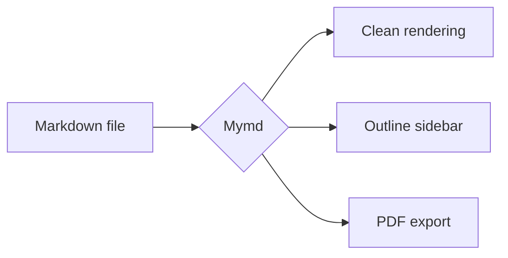

# Mymd Demo Document

A clean markdown viewer. This document shows off everything it supports.

## Text formatting

**Bold**, *italic*, ~~strikethrough~~, `inline code`, and a [link](https://www.anthropic.com) too.

Blockquotes look like this:

> A good tool stays out of the way.
> It lets you focus on the writing.

## Lists

- First item
- Second item
  - Nested item
  - Another nested item
- Third item

1. Ordered list
2. Second
3. Third

### Task list

- [x] Markdown rendering
- [x] Dark mode
- [ ] Take over the world

## Code

```javascript
// Hover a code block to reveal the copy button
function greet(name) {
  const message = `Hello, ${name}!`;
  console.log(message);
  return message.length > 10;
}
```

```python
def fibonacci(n: int) -> int:
    """Compute the nth Fibonacci number."""
    if n < 2:
        return n
    return fibonacci(n - 1) + fibonacci(n - 2)
```

## Table

| Feature | Shortcut | Status |
| --- | --- | --- |
| Open file | `Ctrl+O` | ✅ |
| Find | `Ctrl+F` | ✅ |
| Toggle outline | `Ctrl+B` | ✅ |
| Toggle theme | `Ctrl+Shift+L` | ✅ |
| Export to PDF | `Ctrl+P` | ✅ |
| Zoom in / out | `Ctrl` + wheel | ✅ |

## Math

Inline math $E = mc^2$ and block math are supported:

$$
\int_{-\infty}^{\infty} e^{-x^2} \, dx = \sqrt{\pi}
$$

## Diagram



## Miscellaneous

A horizontal rule:

---

Keyboard input renders like <kbd>Ctrl</kbd> + <kbd>O</kbd>.

> [!TIP]
> Edit and save the file, and the view refreshes automatically.

Done!
