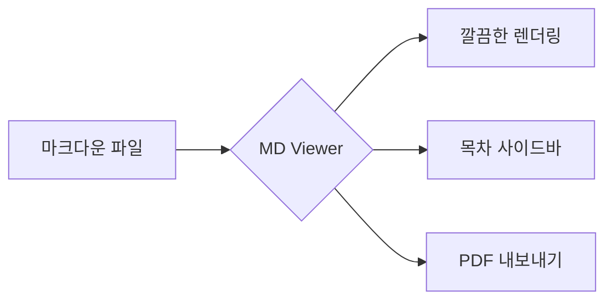

# Mymd 데모 문서

깔끔한 마크다운 뷰어입니다. 이 문서는 지원하는 모든 기능을 보여줍니다.

## 텍스트 서식

**굵게**, *기울임*, ~~취소선~~, `인라인 코드`, 그리고 [링크](https://www.anthropic.com)도 있습니다.

인용문은 이렇게 보입니다:

> 좋은 도구는 눈에 띄지 않는다.
> 글에만 집중할 수 있게 해준다.

## 목록

- 첫 번째 항목
- 두 번째 항목
  - 중첩된 항목
  - 또 다른 중첩 항목
- 세 번째 항목

1. 순서가 있는 목록
2. 두 번째
3. 세 번째

### 할 일 목록

- [x] 마크다운 렌더링
- [x] 다크 모드
- [ ] 세계 정복

## 코드

```javascript
// 코드 블록에 마우스를 올리면 복사 버튼이 나타납니다
function greet(name) {
  const message = `안녕하세요, ${name}님!`;
  console.log(message);
  return message.length > 10;
}
```

```python
def fibonacci(n: int) -> int:
    """피보나치 수를 계산합니다."""
    if n < 2:
        return n
    return fibonacci(n - 1) + fibonacci(n - 2)
```

## 표

| 기능 | 단축키 | 상태 |
| --- | --- | --- |
| 파일 열기 | `Ctrl+O` | ✅ |
| 찾기 | `Ctrl+F` | ✅ |
| 목차 토글 | `Ctrl+B` | ✅ |
| 테마 전환 | `Ctrl+Shift+L` | ✅ |
| PDF 내보내기 | `Ctrl+P` | ✅ |
| 확대 / 축소 | `Ctrl` + 휠 | ✅ |

## 수식

인라인 수식 $E = mc^2$ 과 블록 수식을 지원합니다:

$$
\int_{-\infty}^{\infty} e^{-x^2} \, dx = \sqrt{\pi}
$$

## 다이어그램



## 기타

수평선도 있고요:

---

키보드 입력은 <kbd>Ctrl</kbd> + <kbd>O</kbd> 처럼 표시됩니다.

> [!TIP]
> 파일을 수정하고 저장하면 화면이 자동으로 새로고침됩니다.

끝!
